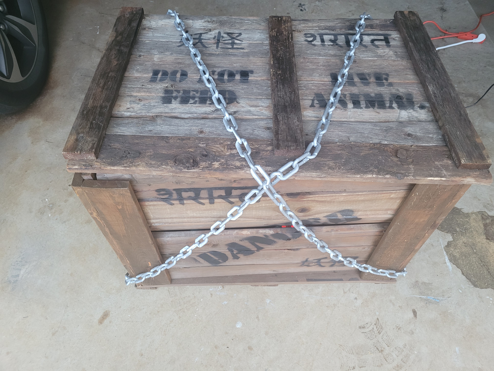
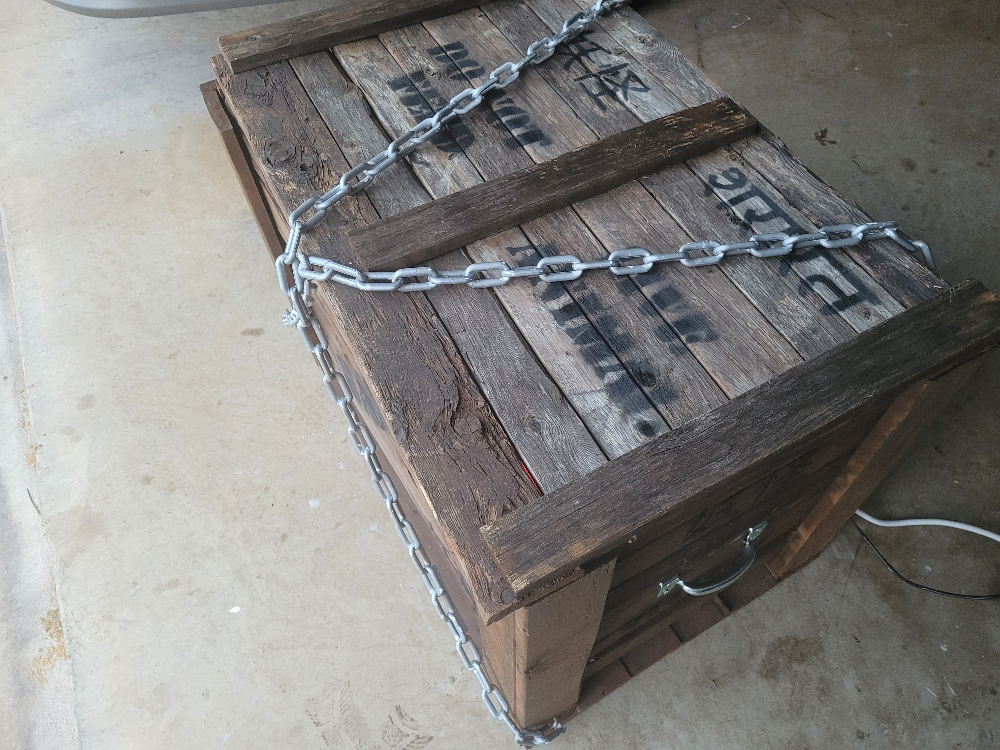
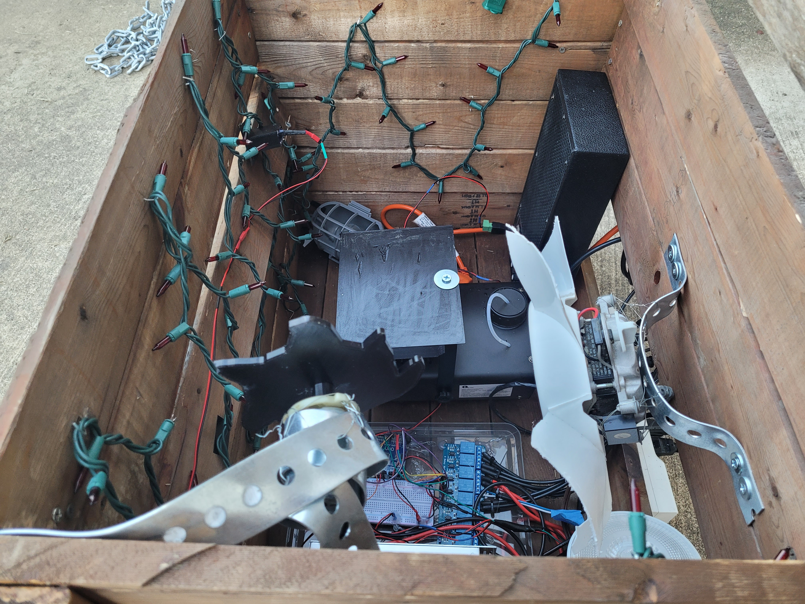
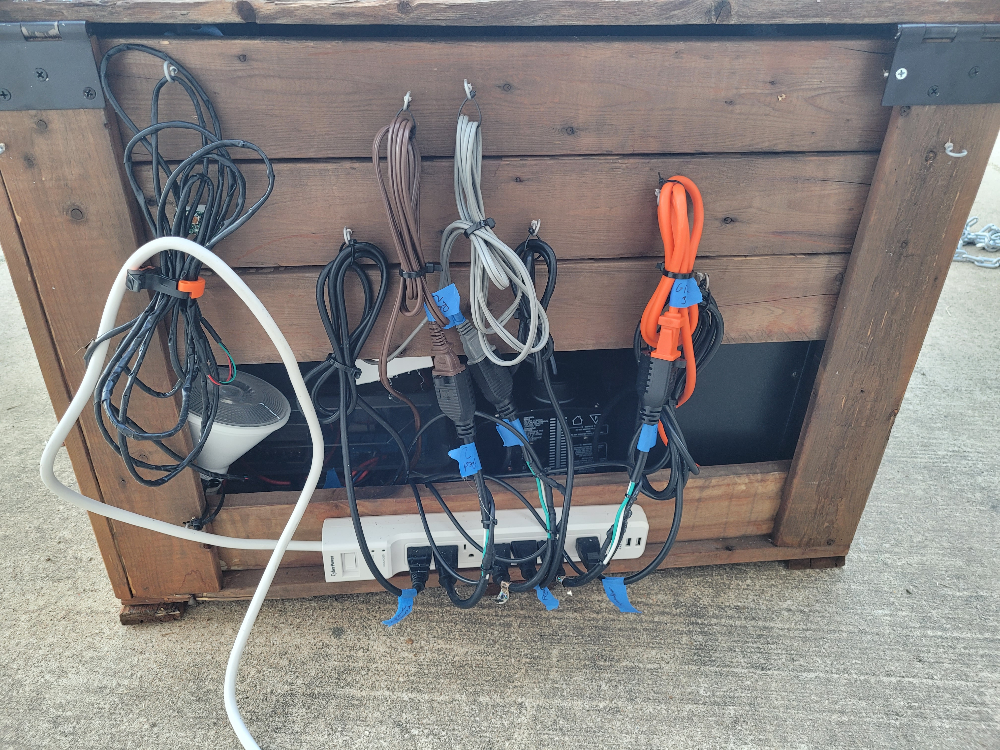
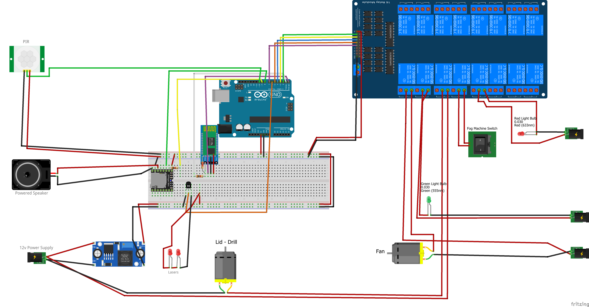
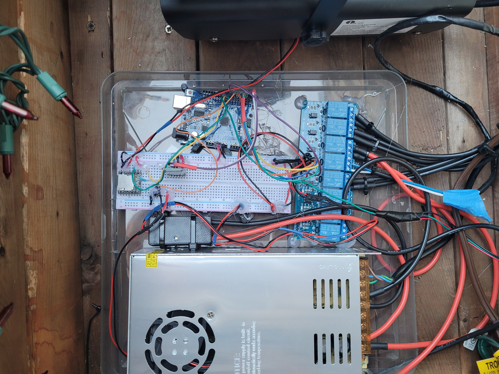
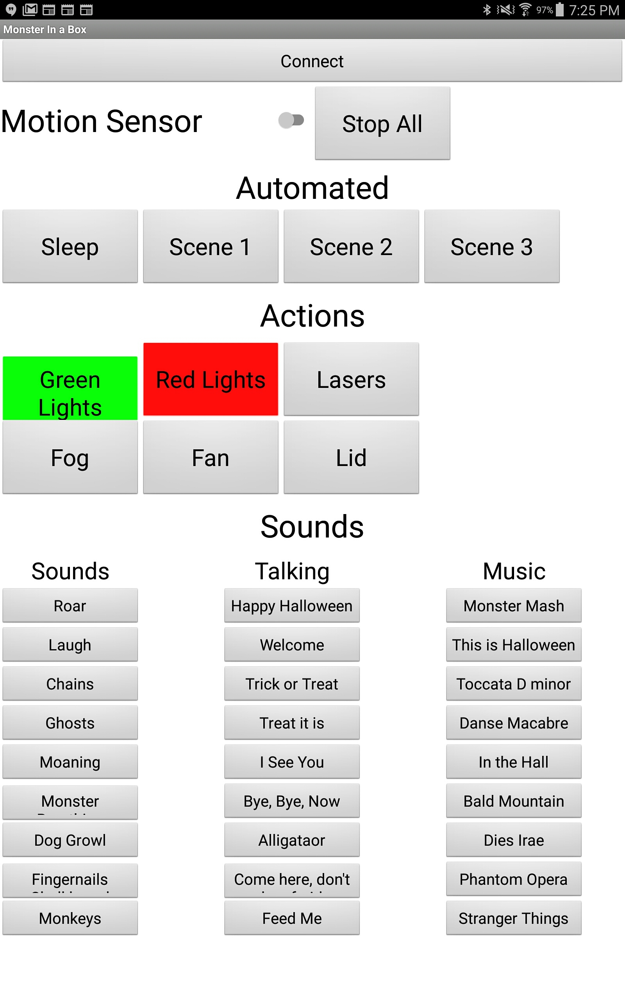

# Monster in a Box

This is my take on a monster in a box. I had a brilliant idea and when I searched I saw so had 100's of others. This is my take on a monster in a box with a lot of thoughts and influence from a variety of projects.

To make halloween a little more fun I wanted to build something that would make people smile with fog, lights, lasers, sounds, and shaking. I wanted to this to be able to run autonomously or controlled via an app to let people control it remotely.

 

Video of the final version 
 

## Building the box

Item list
   - Fence boards (or any plank wood)
   - Screws
   - Wood glue
   - To age the wood
      - Black Tea
      - Vinegar
      - 0000 stell wool
      - Brush

My idea for a Monster in a Box started when I was thinking what I should do with some old fence boards that had been weathered in the backyard for 5 years. I wanted to use the wood for something and this box was it.

 

### Build the box
I sketched the box out a couple of different ways before cutting any wood to get it to the right size. I didn't have enough old wood to build the entire box so I wanted to space that wood out to hopefully give it an overall older look.

Putting the box together was harder than I expected from just a weight of the boards perspective. The boards were pretty heavy and I didn't want any shiny screws showing so I spent a lot of time 

As you build the box make sure to leave gaps, add holes, distress the wood some if it's too new so it looks beat up. It's important to do this before aging the wood.

### Age the wood
I had a mixture of really old wood, somewhat old wood, and brand new wood. 

I looked around and I found a great tutorial that showed the kind of look I wanted for my wood.
https://www.familyhandyman.com/list/how-to-age-wood/

When you're wetting the wood it doesn't look like it's doing too much at the time, as it dries the effects are even more pronounced.

I first applied the black tea and let it dry overnight. The wood looked gray and was starting to age.

I ended up applying too much rust vinegar, the effects initially showed up quickly but then stopped showing up as the wood became saturated. Because of this I kept adding more. This resulted in too much red coming through. It also made the box very rusty after it dried. If you touched the box you got rust all of your hands. I ended up pressure washing the box to get the rust off which ended up helping the weather look as well.

### Things I wish I had known
I made the mistake initially of building the box like a box. I made it fit too tight, I needed more gaps. Make sure to remember what you're building and that you need places for  light to shine and the fog to flow out more easily.

The wood was really heavy, my motors couldn't easily lift it up due to the weight. I would have changed the lid to a more light weight option to allow for more movement and slamming. While this box will hold up for years, it's  big and heavy.

## The Hardware
Item list
   - Old Fan
   - Motor from old broken cordless drill (3D printed cam)
   - Light bulbs
   - Fog machine (3D printed cover to protect the heating element from wood falling in)
   - Christmas lights
   - Practice guitar amp
   - 12V Power Supply

I already had all the hardware from other projects or broken items except for the fog machine. I decided to use a relay switch so I could plug in anything I wanted and mannage it more easily with a surge protector.

For the fog machine I bought the cheapest one I could find that had a remote. I opened up the fog machine and the remote and saw that the remote was simply a switch to turn on the compressor. I didn't want to modify the remote by soldering or adjusting anything so I can use the fog machine for other things. I also wanted to make the arduino the controller so I could control everything through the program and one bluetooth connector.

 

## Electronics Setup
   - Arduino Items
      - Arduino Uno
      - DFPlayer (mp3 player)
      - 2 5V Laser
      - 8 part relay (I only had a 16 relay image in the schematic, but in the real build I used an 8 relay switch)
      - HC-06 bluetooth
      - PIR
      - Buck Converter

 

## The Arduino Code
The code for the project is in the repo, [also linked here](code/Monster.ino)

As I added more buttons and sound options I started running into some memory problems the longer the Monster in the Box was running it ran into bugs so I cut down the code to get to a manageable size with all of the variables. It's not elegant code, but it works. :)

## The App

I thought more fun would come from this project if people could control the box and interact with Trick-or-Treaters or not to interact with the really little kids.

 

As this was my first time connecting to bluetooth on an arduino so I tried it first with MIT App Inventor. It worked so well and so quickly I just stuck with that. 
http://ai2.appinventor.mit.edu/

I assigned one letter to each of the buttons to send as small of information as possible.
 

One key thing to note is that when you send a string from the app it converts it to a byte. Sending bytes from the app to the arduino wasn't working but sending text was so I stuck with text. To save memory in the arduino code I converted the string to byte outside of the code and just read the bytes coming in.

## Putting it All Together
Putting this all together 

